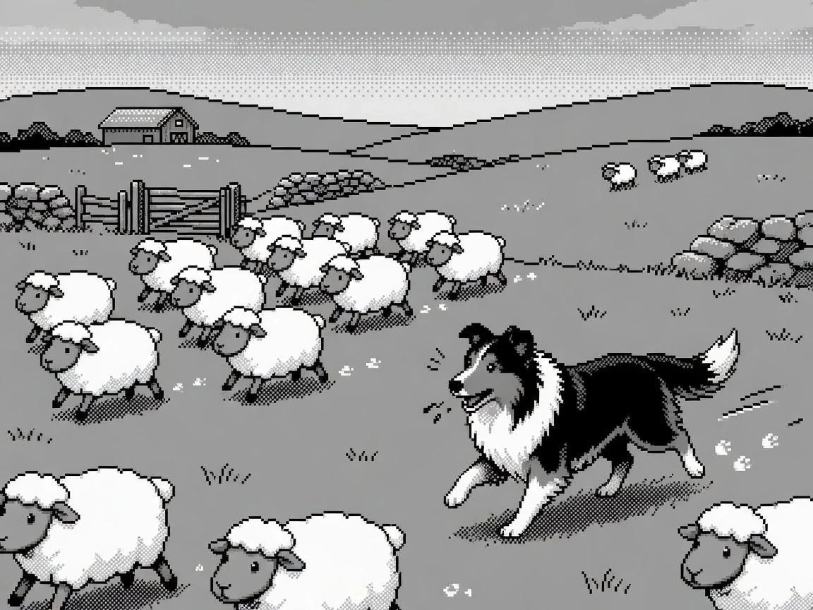
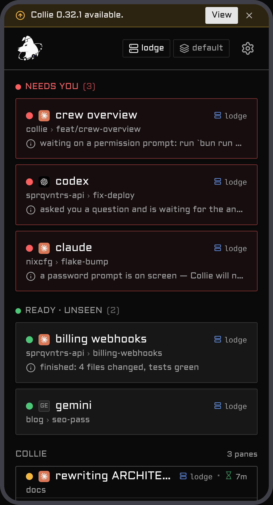
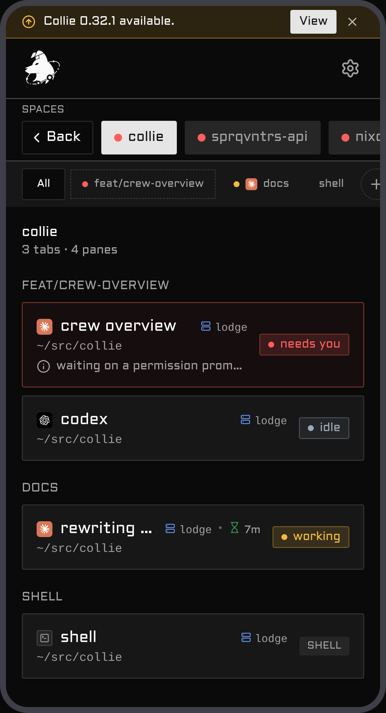
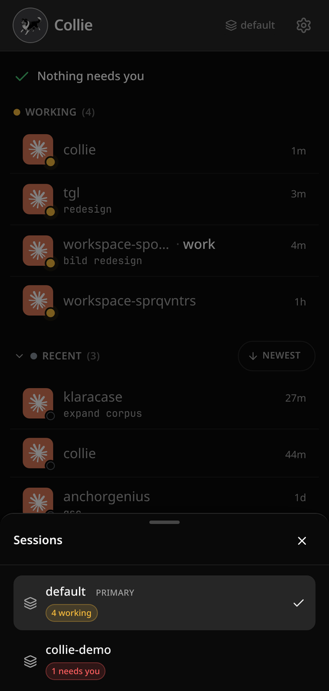
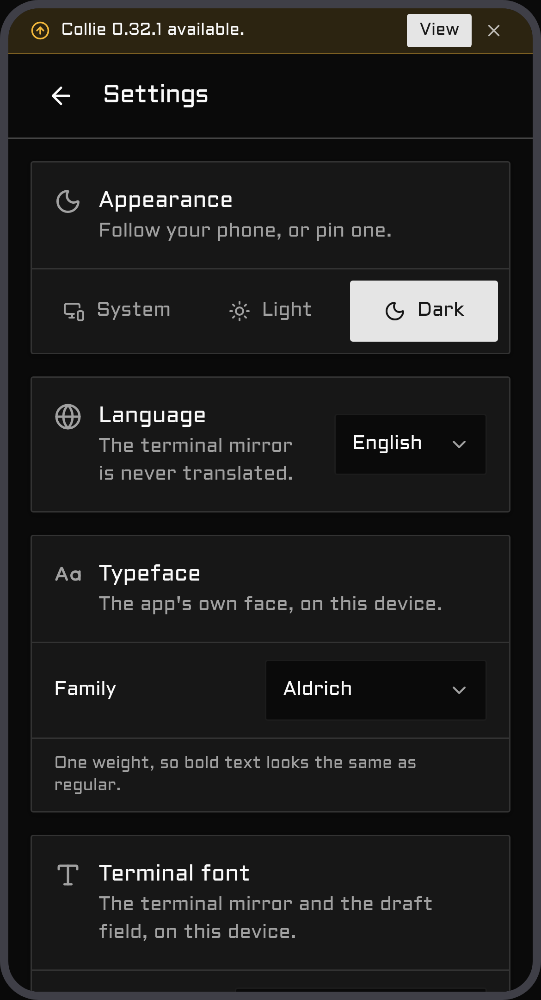

# Collie

<p align="center">
  
</p>

<p align="center">
  <a href="https://colliepwa.dev/demo"><b>Try it in your browser — no install</b></a> ·
  <a href="https://colliepwa.dev">colliepwa.dev</a><br>
  <sub>A real Collie build running in the page against faked data.</sub>
</p>

A phone web UI for the AI agents running in your terminal, served over Tailscale. Collie mirrors one
multiplexer per install — [Herdr](https://herdr.dev), [tmux](https://github.com/tmux/tmux) or
[zellij](https://zellij.dev) — so you can open a URL, see which agent is waiting on you, and answer it
with your phone's keyboard.

The reply box is an ordinary text field, so your phone's own voice dictation works in it — and if you
want a mic that doesn't depend on the keyboard, Collie has its own
[voice input](./docs/voice-and-push.md#voice-input-optional), off until you turn it on.

**Features**

- **React Router + Vite** — TypeScript, Tailwind, shadcn, and a Bun bridge
- **A dashboard ranked by who needs you**, not by what changed last
- **Push notifications** the moment an agent is waiting on you
- **Quick actions and slash commands** per agent — tap, don't type
- **Special-keys pad** — `Esc`, `Ctrl+C`, arrows, combinable modifiers
- **Find in output**, and **conversation history** the terminal can't scroll back to
- **Send an image** from your camera roll
- **Switch between Herdr sessions** without touching the host
- **Installs to your home screen** (PWA) and runs entirely on your own machine — loopback bind, no
  cloud, no account

## Demo

A run through the herd from a phone: the dashboard floats the agent that **needs you** to the top,
you drill into a space's tabs and panes (long-press a pane pill or a tab chip to rename or close it —
and a Claude pane shows the name you gave it with `/rename`), answer an `AskUserQuestion` prompt with
a tap, switch between herds, and pick up a push notification the moment an agent is waiting on input.

To drive it yourself instead of watching, the [interactive demo](https://colliepwa.dev/demo) runs the
real app in your browser against faked data — nothing to install.

<table>
  <tr>
    <td align="center" width="50%"><br><sub><b>Dashboard</b> — agents needing you float to the top</sub></td>
    <td align="center" width="50%"><br><sub><b>Ask</b> — Claude's own questions become tappable buttons</sub></td>
  </tr>
  <tr>
    <td align="center" width="50%"><br><sub><b>Space</b> — its tabs and panes, deep-linkable</sub></td>
    <td align="center" width="50%"><br><sub><b>Keys</b> — the special-keys pad, no chords to remember</sub></td>
  </tr>
  <tr>
    <td align="center" width="50%"><br><sub><b>Session switcher</b> — one collie, every herd</sub></td>
    <td align="center" width="50%"><br><sub><b>Settings</b> — notifications, DND, diagnostics</sub></td>
  </tr>
</table>

## Motivation

I wanted to check on my agents from my phone. The usual route is [Termux](https://termux.dev) — SSH
in, attach to the terminal — but driving a TUI through its on-screen controls is miserable: the
special keys are fiddly, `Ctrl`/`Esc`/arrows are buried behind chords, and every reply is a fight
with the keyboard. I wanted something that feels like an app, not a terminal squeezed onto a
touchscreen: tap the agent that needs you, type with your real keyboard, fire `Esc` or `Ctrl+C` with
one thumb. Collie is that.

## Who is this for

You, if you run AI agents in a terminal on a machine — under Herdr, tmux or zellij — and want to
pick a session back up from your phone. It assumes a **[Tailscale](https://tailscale.com) tailnet**:
your phone and the host are on the same tailnet, and `tailscale serve` is the default way in. It is **single-user** — one
operator, one tailnet, no multi-tenant auth. If you need shared or public access, Collie isn't built
for it. Read the security note below either way.

## Security — read this first

**Collie is remote shell access to your machine, by design.** One Collie API call types arbitrary
keystrokes into a live terminal pane, so anyone who can reach the URL can read every pane (source,
secrets, env, agent output) and run any command as your user, with your full privileges. There is no
sandbox and no command allow-list — that would defeat the purpose. Treat the URL like a root login,
bind it to your tailnet, set `COLLIE_TRUSTED_USER`, and pair the phone you are holding. The sharp
edges, the defenses and the two device gates are [`docs/security.md`](./docs/security.md), and it is
the one page to read before you run anything below.

> 🚫 **Never `tailscale funnel` this** — funnel exposes it to the public internet; `serve` keeps it
> tailnet-only. There is no scenario where funneling Collie is correct.

## Quickstart

On the host, not your phone. It needs `curl`, `tar` and a sha256 tool, no toolchain, and nothing
here asks for `sudo`:

```bash
curl -fsSL https://colliepwa.dev/install.sh | sh
```

It downloads the newest release for your platform, verifies its sha256, lays it down and puts
`collie` on your PATH — then stops and prints the two steps that are yours: seed a config, and
`collie start`. Naming a multiplexer is optional, because that first `start` probes for Herdr, tmux
and zellij and asks you. The script is a convenience and never the only door:
**[`docs/install.md`](./docs/install.md)** builds the same result from source right below it, plus
the Herdr routes, the requirements table, and what the first `start` leaves on the host.

## Documentation

| | |
| --- | --- |
| [**Install**](./docs/install.md) | Requirements, the four install routes, first run, and opening it on your phone |
| [**Security**](./docs/security.md) | What a Collie exposes, the defenses, and pairing a device as the write credential |
| [**Configure**](./docs/configure.md) | The `.env`, your own slash commands, keys, quick replies and typefaces; appearance, Zen mode, language |
| [**Commands**](./docs/commands.md) | Every `collie` verb, putting `collie` on your PATH, and the Herdr actions that mirror the verbs on a Herdr-managed install |
| [**tmux and zellij**](./docs/multiplexers.md) | Running Collie without Herdr — both walkthroughs, what each multiplexer can answer, and agent beacons |
| [**Packs**](./docs/pack.md) | Several machines' Collies behind one URL: invite, join, deputy, failover |
| [**Voice input and Web Push**](./docs/voice-and-push.md) | The microphone in the composer, and notifications when an agent is waiting on you |
| [**Manage & update**](./docs/upgrading.md) | Stop, uninstall, update, the v1 beta train, and upgrading from 0.x to 1.x |
| [**Troubleshooting**](./docs/troubleshooting.md) | Symptoms in the words you would actually search for |

Repository-level specifications live at the root: [`ARCHITECTURE.md`](./ARCHITECTURE.md) ·
[`DEPLOYMENT.md`](./DEPLOYMENT.md) · [`MUX_CONTRACT.md`](./MUX_CONTRACT.md) ·
[`PACK_PROTOCOL.md`](./PACK_PROTOCOL.md) · [`HERDR_API.md`](./HERDR_API.md) ·
[`DESIGN.md`](./DESIGN.md) · [`CONTRIBUTING.md`](./CONTRIBUTING.md).

## Deployment variants

Collie always binds **loopback only**; what changes between deployments is *what sits in front
of it* and *how a request proves who it is*. Variant A is the default and sits below; the other four
are in [`DEPLOYMENT.md`](./DEPLOYMENT.md). Pick one.

### Variant A — `tailscale serve` + person identity (default)

The happy path from [Install](./docs/install.md#install). `tailscale serve` terminates TLS on your MagicDNS name and
injects `Tailscale-User-Login`; set `COLLIE_TRUSTED_USER` to your tailnet login and Collie
rejects anyone else.

```bash
# in your .env
COLLIE_TRUSTED_USER=you@example.com
```

- **Granularity:** the tailnet *person*, not the device.
- **Why it's safe on bare `tailscale serve`:** serve is the *trusted injector* of
  `Tailscale-User-Login` — it sets that header itself and a client can't forge it through the proxy.
- Nothing else to configure; origins match automatically on the MagicDNS name.
- Want *per-device* control without standing up a proxy? [Pair the
  device](./docs/security.md#pair-a-device--the-write-credential) — it composes on top of this variant.

This is the right choice unless you specifically need a proxy in the path. If you do, or if Tailscale
isn't in the path at all, [`DEPLOYMENT.md`](./DEPLOYMENT.md) has the rest:

- **[B — identity-aware proxy, authorised by device](./DEPLOYMENT.md#variant-b--identity-aware-proxy--per-device-authorisation)** — a proxy on this host; some devices drive, others watch.
- **[C — reverse proxy as the only front door](./DEPLOYMENT.md#variant-c--reverse-proxy-as-the-only-front-door-no-tailscale)** — no Tailscale anywhere in the path.
- **[D — off-host identity proxy over the tailnet](./DEPLOYMENT.md#variant-d--off-host-identity-proxy-over-the-tailnet)** — one central ingress node fronting Collie among your other services.
- **[E — any other mesh or tunnel](./DEPLOYMENT.md#variant-e--any-other-mesh-or-tunnel-netbird-zerotier-cloudflare-tunnel)** — NetBird, ZeroTier, Cloudflare Tunnel: you own the ingress, Collie publishes nothing.

## Windows (experimental)

The **bridge** runs on Windows against Herdr's Windows beta; the **launcher** does not. Herdr there
exposes its control socket as a *named pipe* named after the full socket path, not an AF_UNIX
socket, so Collie dials it through `node:net` instead of `Bun.connect` — one shim,
[`bridge/dial.ts`](./bridge/dial.ts), which explains the mapping at the top of the file.

What that means in practice:

- **Run the bridge directly** — `bun run bridge/index.ts`. There's no systemd unit, and the Herdr
  action buttons shell out to `bash`, so they only work if Git Bash is on `PATH`. The manifest
  therefore still declares `linux`/`macos` only, rather than advertising buttons that may not fire.
- **`tailscale serve` isn't wired up here.** Use the
  [Variant C](./DEPLOYMENT.md#variant-c--reverse-proxy-as-the-only-front-door-no-tailscale) posture: loopback bind, your own ingress in front, `COLLIE_PUBLIC_HOSTS` pinned. The security
  rules in [§Security](./docs/security.md) are not relaxed on Windows.
- **Set `COLLIE_MULTI_SESSION=off`** — session discovery derives POSIX paths.
- The socket path defaults to `%APPDATA%\herdr\herdr.sock`; override with `HERDR_SOCKET_PATH`
  (an explicit `\\.\pipe\…` value is passed through untouched).

**Want the lifecycle too?** The bridge has spoken Windows' named pipe since 0.15.0; a
community-maintained Task Scheduler setup (start/stop/update, no supported-tree guarantees) lives in
[`contrib/windows/`](./contrib/windows/README.md).

**Is it actually working?** The bridge logs `[events] stream up` on start — the event stream works
over the pipe, so Windows gets the same live updates as Linux, not degraded polling.

`COLLIE_HERDR_DIAL=net` forces that same dialer on Linux/macOS. It exists so the Windows code path
can be exercised — and regression-tested — without a Windows box; `bridge/dial.test.ts` uses it.

## Architecture

A small Bun process sits between your phone and your multiplexer — the browser never touches the
multiplexer.

```
  phone (PWA)
     │  HTTPS over the tailnet
     ▼
  tailscale serve        terminates TLS, injects the identity header
     │  127.0.0.1:PORT    (the bridge binds loopback only)
     ▼
  Collie bridge (Bun)    serves the UI + a small JSON API; polls the multiplexer
     │  one mux adapter, chosen per install
     ▼
  the multiplexer        owns the panes, agents and terminal state
  Herdr · tmux · zellij
```

Under [Variant C](./DEPLOYMENT.md#variant-c--reverse-proxy-as-the-only-front-door-no-tailscale) a
reverse proxy replaces the `tailscale serve` box; everything below the front door is identical.

- **Only the adapter touches the multiplexer** (`bridge/mux/<name>/` — Herdr dials a Unix socket, tmux and zellij shell out to their CLIs); everything else speaks the bridge's HTTP API. What every adapter must answer is [`MUX_CONTRACT.md`](./MUX_CONTRACT.md).
- **Polling is still the model** — the bridge takes one snapshot per tick from the adapter and the browser polls `/api/snapshot`; where the multiplexer offers an event stream (Herdr does) it only pokes the bridge's poll to go faster, it never replaces it. No resync logic.
- **Actions are plain HTTP** — a reply or key `POST`s to `/api/pane/:id/{reply,keys}`, and the adapter types it into a real terminal (hence the security posture).
- **The UI is a static PWA** — Vite builds `web/dist`, served from disk, so a rebuild is live with no restart.
- **A second Collie is a peer, not a second bridge** — one machine's bridge mirrors one multiplexer, and a lead reads its peers over the pack link ([`PACK_PROTOCOL.md`](./PACK_PROTOCOL.md)).

Full design rationale in [`ARCHITECTURE.md`](./ARCHITECTURE.md).

## Developing

Clone it and build it ([Install → the same result, from
source](./docs/install.md#the-same-result-from-source)), then edit in place.

- **Every verb is implemented once, in `cli/`,** and spelled `bin/collie <verb>`
  ([Commands](./docs/commands.md)). Nothing else implements a verb: `scripts/collie-ctl.sh` is a
  bootstrap shim that compiles the binary and hands it your argv, and the Herdr adapter's
  `herdr-plugin.toml` is a thin registration whose `[[actions]]` call that shim
  ([Herdr actions](./docs/commands.md#herdr-actions)). Both files are commented — read them, not a
  paraphrase of them here.
- **One asymmetry in the dev loop:** `web/` rebuilds go live with no restart (the bridge serves
  `web/dist` from disk); `bridge/` changes need `systemctl --user restart collie`. Build, test and
  versioning rules are in [`CLAUDE.md`](./CLAUDE.md) — versioning is hook-enforced, so skim it before
  your first commit.
- **Adding or changing a multiplexer adapter** — [`MUX_CONTRACT.md`](./MUX_CONTRACT.md) says what an
  adapter must answer, and [`MUX_CONTRIBUTING.md`](./MUX_CONTRIBUTING.md) walks the seam. Why Collie
  is a supervised service and not a plugin pane is [`ARCHITECTURE.md`](./ARCHITECTURE.md) §3 — the
  decision that keeps the Herdr manifest down to `[[actions]]` and `[[build]]`.
- **Sending a PR?** [`CONTRIBUTING.md`](./CONTRIBUTING.md) is the short version — which branch to
  open against (bugfixes on `main`, features on `v1`), the gates, and the version-bump rule.

### The states playground

A dev-only page that renders the real app components in every state — boot, idle, dashboard, pack,
settings and so on — without a live agent behind them. Useful for eyeballing a banner, the mark, the
boot splash, or the idle lock across every state at once, instead of driving the real app into each
one by hand.

```
cd web && COLLIE_DEV_HOSTS=bluefin,localhost bun run playground
```

Open `http://<host>:5199/playground.html`. On 5199 the root redirects to the playground and `/api`
is dead, so nothing on that port can reach a real Collie instance. It never ships: Vite's build only ever walks the root
`index.html`, so `playground.html` and everything under `src/playground/` stay out of `dist` and out
of the PWA precache. `src/playground/playground-entry.test.ts` pins that.

To add a new state, add a `<Section>` in `src/playground/app.tsx` and its fixtures in
`src/playground/fixtures.ts`.

Working on the Herdr adapter specifically? Herdr's own plugin system is upstream's to document:
[authoring](https://herdr.dev/docs/plugins/) ·
[CLI reference](https://herdr.dev/docs/cli-reference/) ·
[example plugins](https://github.com/ogulcancelik/herdr-plugin-examples). Collie's verified use of
the socket is [`HERDR_API.md`](./HERDR_API.md).

## See also

- Every how-to page — [`docs/`](./docs/)
- Deployment variants B–E — [`DEPLOYMENT.md`](./DEPLOYMENT.md)
- Design & rationale — [`ARCHITECTURE.md`](./ARCHITECTURE.md)
- What each multiplexer can answer — [`MUX_CONTRACT.md`](./MUX_CONTRACT.md)
- The lead↔peer pack link — [`PACK_PROTOCOL.md`](./PACK_PROTOCOL.md) (topology diagram: [§2](./PACK_PROTOCOL.md#2-shape-of-the-thing))
- Recovering a pack whose lead died, from a phone — [`DEPLOYMENT.md` → the standby door](./DEPLOYMENT.md#the-standby-door--a-packs-failover-path)
- Verified Herdr socket API — [`HERDR_API.md`](./HERDR_API.md)
- Ops, versioning & conventions — [`CLAUDE.md`](./CLAUDE.md)
- Sending a PR — [`CONTRIBUTING.md`](./CONTRIBUTING.md)
- Changes — [`CHANGELOG.md`](./CHANGELOG.md)
