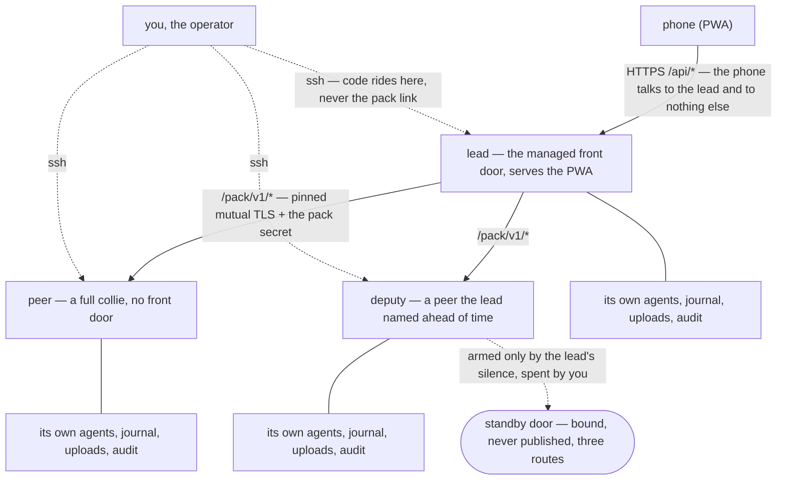

# Pack commands

A **pack** links multiple Collie instances together under a single **lead**, exposing every herd to
the phone through one URL. Management happens entirely via the CLI without Herdr UI actions.
Machine-to-machine traffic uses the protocol documented in
[`PACK_PROTOCOL.md`](../PACK_PROTOCOL.md).

Architecture before running commands: only the lead exposes the front door, while peers expose none.



**Two machines, one pack.** The lead is the instance your phone already reaches. The joining machine
must have Collie installed and running. On the **lead**:

```bash
collie pack invite        # prints one line: <token>.<lead-fingerprint>
```

Tokens are single-use, valid for ten minutes, and displayed once. The lead stores only the hash.
Running `invite` restarts the lead process so it can accept the incoming enrollment. Copy the output
line to the target machine and run:

```bash
collie pack join lead                     # it asks for the token
```

`pack invite` prints this exact line with your lead's name already in it. In a terminal, `join` asks
for the token; for a script, pass `-` and put the token on stdin instead:

```bash
collie pack join lead.tail1234.ts.net -   # paste the token on stdin
```

Set the lead address to any hostname or `host:port` reachable from this node. An address with no
scheme and no port means `https://<host>:8787`, because 8787 is the port a Collie binds. The
`pack invite` line spells the port out when this lead moved off it. A default install answers there
over plain HTTP, with TLS on 443 in front of it, so `join` may find no TLS at 8787: it then asks
once whether to send the token over plain HTTP, and `--insecure` answers that question ahead of
time. An address
you spelled `http://` yourself still requires `--insecure` and asks nothing. Pass `-` to read the
token from stdin or `@<file>` to read from disk. Passing raw tokens directly as arguments prints a
warning, because process listings expose arguments to all local users
([`PACK_PROTOCOL.md` §8.3](../PACK_PROTOCOL.md)).

`join` names the final required step: **`collie restart` on the lead.** The lead wrote the
enrollment to disk, but the active process cached the roster at startup and will not proxy traffic
to the new peer until restarted. Restart the lead, then check connectivity:

```bash
collie pack status        # the new member, its address, and whether the link answered
```

`collie pack add <ssh-host>` runs this workflow over **SSH**. It generates the token locally,
provisions Collie on the remote machine, and executes `collie pack join` remotely. Choose either
manual enrollment or `pack add` for a given host, not both. `pack add` requires **Herdr preinstalled
on the remote host** and does not support `--insecure`. If the lead uses plaintext HTTP, run
`collie pack join --insecure` manually on the joining machine instead.

**Multiplexer selection is local to each node.** Configure `COLLIE_MUX` in the node's `.env` file.
The pack protocol contains no multiplexer-specific fields. Note that peers have only been tested
with Herdr in v1 ([`PACK_PROTOCOL.md` §16](../PACK_PROTOCOL.md)).


| Command | What it does |
| --- | --- |
| `collie pack invite` | Mint a single-use, 10-minute enrollment token (**on the lead**) |
| `collie pack add <ssh-host>` | Install and enroll a peer over **your own SSH** (on the lead) |
| `collie pack update <member>… \| --all` | Level peers to this lead's build over SSH ([above](upgrading.md#updating-the-rest-of-the-pack)) |
| `collie pack status` | Mode, members, reachability, secret pickup — and why a link is refused |
| `collie pack rotate` | Reissue the pack secret and hand it to every reachable peer |
| `collie pack remove <member>` | Unpin and forget a member (on the lead) |
| `collie pack set-address <member> <host:port>` | Correct where this lead dials a member |
| `collie pack deputy <member>` | Name the ONE peer that may take over, and arm it; `--revoke` names nobody |
| `collie pack approve-promote <member>` | Consent, on the lead, for one member to take over — 10 minutes, single-use; `--cancel` clears it |
| `collie pack join <lead-address> [<token>]` | Join a pack (**on the joining machine**); with no token it asks for one, or pass `-` for stdin or `@file` |
| `collie pack leave` | Leave the pack — drops the pack secret and every pin on this machine |
| `collie promote` | Make THIS machine the lead (on the peer taking over; `--force` if the lead is gone) |
| `collie reconnect` | A member moved: re-point at its new address without re-enrolling anything |

`collie join` and `collie leave` still work. They are aliases for `collie pack join` and
`collie pack leave`, with the same arguments and the same exit codes.

The `deputy`, `approve-promote`, and `promote` commands manage failover. For setup and recovery
instructions, see
[`DEPLOYMENT.md` → the standby door](deployment.md#the-standby-door--a-packs-failover-path) and
[the bad day](deployment.md#the-bad-day--the-runbook).


---

[← back to the README](../README.md)
